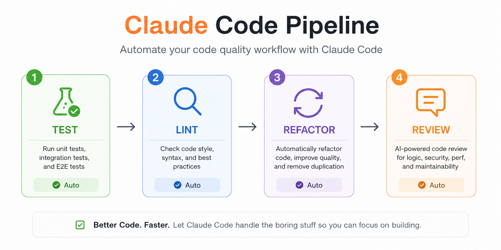

# pipeline — Claude Code Plugin

A Claude Code plugin that lets you define multi-step automated pipelines in YAML and run them with a single command. Claude executes each step in sequence — agent steps run prompts, shell steps run bash commands — and the pipeline advances automatically after each step without user intervention.



## Requirements

- Claude Code v2.1+ (with plugin support)

## Install

Claude Code uses a marketplace catalog for discovery — you add the marketplace once, then install individual plugins from it.

```
/plugin marketplace add hungnb94/claude-code-pipeline
/plugin install pipeline@claude-code-pipeline
```

## Quick start

1. Create a pipeline YAML file in your project:

```yaml
# .pipeline/pipeline.yaml
entry: plan

steps:
  plan:
    type: agent
    prompt: |
      Analyze the codebase and write a step-by-step implementation plan.
    next: implement

  implement:
    type: agent
    prompt: |
      Implement the plan: {{plan_output}}
    next: test

  test:
    type: shell
    commands:
      - npm test
    next: done
    next_fail: fix

  fix:
    type: agent
    prompt: |
      Fix the test failures: {{test_output}}
    next: test
    max_visits: 3

  done:
    type: agent
    prompt: |
      Summarize what was implemented.
```

2. Run the pipeline:

```
/pipeline:run
```

Or point to a specific file, optionally with inline requirements:

```
/pipeline:run path/to/my-pipeline.yaml
/pipeline:run Add authentication with JWT tokens
/pipeline:run path/to/my-pipeline.yaml Add authentication with JWT tokens
```

Inline requirements are stored as `{{user_requirements}}` in shared state and can be referenced in any step's `prompt` field.

Claude will execute each step automatically, without you needing to prompt it between steps.

## Pipeline YAML reference

### Top-level fields

| Field   | Required | Description                           |
| ------- | -------- | ------------------------------------- |
| `entry` | yes      | Name of the first step to execute     |
| `steps` | yes      | Map of step names to step definitions |

### Agent step

Claude executes the `prompt` and produces output.

```yaml
step_name:
  type: agent
  prompt: |
    Your instructions here.
    Use {{other_step_output}} to reference previous step results.
  next: next_step_name # omit to end the pipeline
```

### Shell step

One or more shell commands run via Bash. Pass/fail determined by exit code.

```yaml
step_name:
  type: shell
  commands:
    - npm test
    - npm run lint
  next: on_success # step to run if all commands exit 0
  next_fail: on_failure # step to run if any command fails (omit to end pipeline)
  max_visits: 5 # optional: halt pipeline if step is visited N or more times
```

### Shared state

Agent steps can pass output to later steps using `{{step_name_output}}` in prompts. After completing a step, Claude writes a one-line summary to the shared state under the key `<step_name>_output`.

### Terminating a pipeline

A step with no `next` field ends the pipeline when it completes. Alternatively, set `terminal: true` on a step to end the pipeline immediately when it is reached (before executing its prompt).

### Loop guard

Use `max_visits: N` on any step to halt the pipeline with an error if the step is visited N or more times. Useful for fix→verify→fix cycles where you want a safety ceiling.

## How it works

- **Trigger**: typing `/pipeline:run` fires a `UserPromptSubmit` hook that reads the YAML, initializes pipeline state at `.pipeline/state.json`, and injects the first step's instructions into the conversation.
- **Continuation**: after each Claude response, a `Stop` hook reads the current step from state and injects the next step's instructions — no user input required between steps.
- **Progress header**: each step emits a progress line showing completed steps (✅) and the current step (🔄), e.g. `✅ plan → ✅ review → 🔄 implement`. This appears as a visible notification in the Claude Code UI (via stderr) before Claude's response, so you always know where the pipeline is.
- **State**: pipeline state is stored per-session in `.pipeline/state.json`. Multiple concurrent sessions in the same project are isolated by session ID.

> **Note:** Both hooks require the `CLAUDE_PROJECT_DIR` environment variable to be set to the project root. Claude Code sets this automatically when running hooks — if you run hooks manually for debugging, set the variable explicitly: `CLAUDE_PROJECT_DIR=$(pwd) node hooks/check_pipeline.js`.

## Status line integration

If you have a `~/.claude/statusline.sh` configured as your Claude Code status line, run this skill once to add pipeline state display to it:

```
/pipeline:setup-statusline
```

While a pipeline is active, your status line will show a third line:

```
[pipeline-name] ✅ prev-step → 🔄 current-step
[pipeline-name] ✅ verify → 🔄 fix (×3)   ← red retry count when looping
```

The block is inserted at the end of your existing script and is silent when no pipeline is running. Safe to run multiple times — idempotent.

> **Requires:** `jq` installed, and `~/.claude/statusline.sh` must already exist and define `$CYAN`, `$GREEN`, `$YELLOW`, `$RED`, `$RESET` color variables.

## Examples

See [`examples/pipeline.yaml`](examples/pipeline.yaml) for a full plan → execute → verify → review pipeline.

## Uninstall

```
/plugin uninstall pipeline@claude-code-pipeline
```
